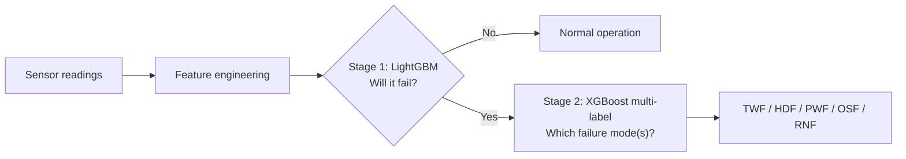

# Industrial Predictive Maintenance

> Predict machine failures from sensor readings, and identify *which* failure mode is coming, so maintenance can be scheduled before a breakdown instead of after.


Developed as part of the **Elevvo internship**, following the **PACE framework** (Plan → Analyze → Construct → Execute) on the AI4I 2020 Predictive Maintenance dataset.

---

## Highlights

| | |
|---|---|
| **Task 1** | Binary classification: will the machine fail? (LightGBM) |
| **Task 2** | Multi-label classification: which failure mode(s)? (XGBoost) |
| **Data** | 10,000 machine records, 6.4% failures (heavily imbalanced) |
| **Key constraint** | Minimize the **False Discovery Rate**: fewer false alarms, even at a small cost in accuracy |
| **Stage 1 result** | 98.4% test accuracy, **FDR 5.9%**, precision 94.1%, recall 81.8% |
| **Stage 2 result** | Weighted precision 98.6%, weighted F1 93.9%, perfect scores on HDF and PWF |
| **Explainability** | SHAP summary and force plots for both models |

## Table of Contents

- [Business Problem](#business-problem)
- [Dataset](#dataset)
- [Methodology (PACE)](#methodology-pace)
- [Feature Engineering](#feature-engineering)
- [Modeling Approach](#modeling-approach)
- [Results](#results)
- [Repository Structure](#repository-structure)
- [Getting Started](#getting-started)
- [Limitations and Known Caveats](#limitations-and-known-caveats)
- [Future Work](#future-work)
- [Resources](#resources)
- [License](#license)
- [Author](#author)

---

## Business Problem

A single unplanned machine failure can cost a factory heavily in downtime, lost revenue, and repair work. But a predictive model that cries wolf is also expensive: every false alarm stops production for an inspection that wasn't needed.

**Stakeholders**

| Group | Interest |
|---|---|
| Primary | Factory owner |
| Secondary | Operations manager (process optimization), customer support (complaints about delays), finance (cost of lost revenue and repairs) |
| Indirect | Customers who depend on the product being delivered on time |

**Goal and boundary.** The objective is not raw accuracy. It is to build classifiers that flag real failures while keeping the **False Discovery Rate (FDR = 1 − precision)** low. Models are evaluated and tuned with that constraint in mind, even if overall accuracy drops slightly.

## Dataset

**AI4I 2020 Predictive Maintenance Dataset** ([Kaggle](https://www.kaggle.com/datasets/stephanmatzka/predictive-maintenance-dataset-ai4i-2020)), a synthetic dataset designed to resemble real industrial milling-machine data.

- **10,000 rows × 14 columns**, no missing values, no duplicate rows
- **Type:** L (61%), M, and H product quality variants
- **Target:** `Machine failure` (638 failures, 6.38%)

| Column | Description |
|---|---|
| `UDI`, `Product ID` | Row and product identifiers (dropped before modeling) |
| `Type` | Product quality variant: L / M / H |
| `Air temperature [K]` | Ambient temperature (mean ≈ 300 K) |
| `Process temperature [K]` | Process temperature (mean ≈ 310 K) |
| `Rotational speed [rpm]` | Spindle speed (887 to 2,171) |
| `Torque [Nm]` | Applied torque (2.9 to 77.2) |
| `Tool wear [min]` | Cumulative tool usage (0 to 249) |
| `Machine failure` | 1 if the machine failed, 0 otherwise |
| `TWF` | Tool Wear Failure (154 cases) |
| `HDF` | Heat Dissipation Failure (158 cases) |
| `PWF` | Power Failure (22 cases) |
| `OSF` | Overstrain Failure (339 cases) |
| `RNF` | Random Failure (10 cases) |

Failure modes can overlap: a single failed machine can have more than one flag set.

## Methodology (PACE)

### 1. Plan (`01_Plan.ipynb`)
Framed the business scenario, identified stakeholders, defined deliverables (a failure classifier and a failure-type classifier), set the FDR boundary, and did an initial data inspection (shape, summary statistics, dtypes).

### 2. Analyze (`02_Analyze.ipynb`)
- Checked for nulls and duplicates (none found) and standardized column names
- **Outlier handling:** capped values outside 1.5 × IQR for the five numeric sensor features
- Explored distributions, box plots, pair plots split by failure class, a correlation heatmap, and failure ratios by machine type

**Key EDA findings**

- Air temperature and process temperature are strongly linearly related
- Air temperature, process temperature, and rotational speed are roughly normally distributed; tool wear is roughly uniform
- Most failures come from **tool wear, overstrain, and heat dissipation**, and multiple failure modes can occur at once
- Failures cluster at high torque (≈ 43 to 77 Nm) and high tool wear (≈ 160 to 249 min)
- The target is heavily imbalanced: **93.6% no failure vs 6.4% failure**
- Type L machines account for most failures (≈ 72%), followed by M (≈ 21%) and H (≈ 7%)

### 3. Construct (`03_Construct_v1.ipynb`, `03_Construct_v2.ipynb`)
Feature engineering, preprocessing pipelines, model comparison with grid search, evaluation, and SHAP explainability.

- **v1:** binary machine-failure prediction (4 models compared)
- **v2:** failure-type prediction (multi-label, trained on failed machines only)

### 4. Execute (`04_Execute.ipynb`)
Interpretation of results and stakeholder recommendations. *(In progress.)*

## Feature Engineering

Three physically motivated features were added to the five raw sensor readings:

| Feature | Formula | Intuition |
|---|---|---|
| `Power[W]` | `Torque × RPM × 2π / 60` | Mechanical power delivered by the spindle |
| `strain` | `Tool wear × Torque` | Combined load and wear on the tool |
| `Temperature_difference` | `Process temp − Air temp` | Heat the process adds; a proxy for cooling efficiency |

The failure-mode columns (`TWF`, `HDF`, `PWF`, `OSF`, `RNF`) are excluded from the features for the failure-detection model to avoid target leakage.

## Modeling Approach



**Shared setup**
- 80/20 train/test split (`random_state=42`)
- `ColumnTransformer` preprocessing inside a scikit-learn `Pipeline`: `StandardScaler` for numeric features, `OneHotEncoder` for `Type`

**Stage 1: failure detection (`03_Construct_v1`)**
- Compared **Logistic Regression, Random Forest, LightGBM, and XGBoost**, each tuned with `GridSearchCV` (`cv=2`)
- Class imbalance handled with `class_weight="balanced"` (LR, RF, LightGBM) and `scale_pos_weight=14` (XGBoost)
- LightGBM was selected as the deliverable model. Best parameters: `gbdt` boosting, `learning_rate=0.05`, `n_estimators=500`, balanced class weights
- Saved to `Models/lgbm_model_failure.joblib`

**Stage 2: failure type (`03_Construct_v2`)**
- Trained only on rows where a failure occurred (638 records)
- `MultiOutputClassifier(XGBClassifier)` predicts the five failure-mode flags at once, so overlapping failures are supported
- Saved to `Models/XGBoosts_model_type_failure.joblib`

**Explainability.** Both models are explained with SHAP (`TreeExplainer`): global importance bar plots, beeswarm summary plots, and force plots for individual predictions.

## Results

### Stage 1: Machine failure detection (2,000 test rows, 137 real failures)

| Model | Accuracy | Precision | Recall | F1 | FDR |
|---|---|---|---|---|---|
| Logistic Regression | 0.798 | 0.228 | 0.818 | 0.357 | 0.772 |
| Random Forest | 0.986 | 0.982 | 0.803 | 0.884 | 0.018 |
| **LightGBM** (selected) | **0.984** | **0.941** | **0.818** | **0.875** | **0.059** |
| XGBoost | 0.980 | 0.894 | 0.803 | 0.846 | 0.106 |

For the selected LightGBM model on the test set: **112 failures caught, 25 missed, 7 false alarms** out of 2,000 readings.

Logistic Regression catches failures but at a heavy false-alarm cost (FDR 77%), which is exactly the behavior the business constraint rules out.

### Stage 2: Failure type prediction (test split of failed machines)

| Failure mode | Precision | Recall | F1 | Support |
|---|---|---|---|---|
| Tool Wear (TWF) | 1.00 | 0.70 | 0.83 | 44 |
| Heat Dissipation (HDF) | 1.00 | 1.00 | 1.00 | 34 |
| Power (PWF) | 1.00 | 1.00 | 1.00 | 5 |
| Overstrain (OSF) | 0.97 | 1.00 | 0.98 | 58 |
| Random (RNF) | 0.00 | 0.00 | 0.00 | 0 |
| **Weighted average** | **0.986** | **0.908** | **0.939** | 141 |

Exact-match accuracy on the test split is 0.891 (all five flags correct), and the weighted FDR is 0.014.

### Takeaways

- **Torque, tool wear, power, and strain** are the features most associated with failure, which lines up with the EDA findings.
- Tree-based boosting models clearly beat the linear baseline on this imbalanced problem.
- Heat dissipation, power, and overstrain failures are identified reliably. **Tool wear failures are the hardest to catch** (recall 0.70).
- Random failures (10 in the whole dataset) are effectively unpredictable, as expected for events that are random by definition.

## Repository Structure

```
Industrial_Predictive_Maintenance_Elevvo_internship/
├── Data/
│   ├── Row_data/
│   │   └── ai4i_predictive_maintenance.csv   # Original dataset
│   └── processed/
│       ├── df_cleaned.csv                    # Cleaned data (output of 02_Analyze)
│       └── df_cleaned_1.csv                  # Cleaned data with engineered features
├── Models/
│   ├── lgbm_model_failure.joblib             # Stage 1: failure detection
│   └── XGBoosts_model_type_failure.joblib    # Stage 2: failure type
├── Notebooks/
│   ├── 01_Plan.ipynb                         # Problem framing and initial inspection
│   ├── 02_Analyze.ipynb                      # Cleaning and EDA
│   ├── 03_Construct_v1.ipynb                 # Failure detection models
│   ├── 03_Construct_v2.ipynb                 # Failure type model
│   └── 04_Execute.ipynb                      # Results and recommendations
├── LICENSE
└── README.md
```

## Getting Started

### Prerequisites

- Python 3.9+
- Jupyter Notebook, JupyterLab, or Google Colab

### Installation

```bash
git clone https://github.com/abdulrahman0700/Industrial_Predictive_Maintenance_Elevvo_internship.git
cd Industrial_Predictive_Maintenance_Elevvo_internship

python -m venv venv
source venv/bin/activate          # Windows: venv\Scripts\activate

pip install pandas numpy scipy matplotlib seaborn shap lightgbm xgboost \
            imbalanced-learn jupyter "scikit-learn==1.6.1"
```

> **Important:** the saved `.joblib` models were created with **scikit-learn 1.6.1** and need `imbalanced-learn` installed to load. Other scikit-learn versions can fail to unpickle them.

### Running the notebooks

Run the notebooks in order (`01` → `02` → `03_v1` / `03_v2` → `04`). They were written in Google Colab and read data from paths such as `/content/ai4i_predictive_maintenance.csv`, so when running locally, update the `pd.read_csv(...)` paths to point at the files in `Data/`.

### Using the trained models

```python
import joblib
import pandas as pd

failure_model = joblib.load("Models/lgbm_model_failure.joblib")           # stage 1: will it fail?
type_model    = joblib.load("Models/XGBoosts_model_type_failure.joblib")  # stage 2: which failure mode(s)?

# One machine reading (column names match the training data exactly)
sample = pd.DataFrame([{
    "Type": "L",
    "Air_temperature__K": 298.1,
    "Process_temperature__K": 308.6,
    "Rotational_speed__rpm": 1300,
    "Torque__Nm": 65.0,
    "Tool_wear__min": 220,
}])

# Engineered features (same formulas as the notebooks)
sample["Power_W"] = (sample["Torque__Nm"] * sample["Rotational_speed__rpm"] * 2 * 3.141592653589793 / 60).round(2)
sample["strain"] = sample["Tool_wear__min"] * sample["Torque__Nm"]
sample["Temperature_difference"] = sample["Process_temperature__K"] - sample["Air_temperature__K"]

will_fail = failure_model.predict(sample)[0]
print("Predicted failure:", bool(will_fail))

if will_fail:
    sample["Machine_failure"] = 1   # the type model was trained on failed rows only and expects this column
    labels = ["TWF", "HDF", "PWF", "OSF", "RNF"]
    flags = type_model.predict(sample)[0]
    print("Failure mode(s):", [l for l, f in zip(labels, flags) if f])
```

## Limitations and Known Caveats

- **Synthetic data.** AI4I is a synthetic dataset, so results may not transfer directly to real machines.
- **Possible overfitting.** The tree-based models reach ~100% training accuracy against ~98% test accuracy, and tuning used only 2-fold cross-validation. More folds and early stopping would give a more reliable estimate.
- **Model choice vs. the FDR goal.** Random Forest achieved a lower FDR (0.018) than the selected LightGBM (0.059) on the test set. LightGBM was chosen as the required model for this project.
- **Small evaluation set for failure types.** The stage 2 test split contains only ~128 failed machines, and Random Failure has no test examples, so its 0.00 scores are not informative.
- **Preprocessing before the split.** Outlier capping was applied to the full dataset before the train/test split.

## Future Work

- Use stratified k-fold cross-validation with early stopping for more reliable estimates
- Try resampling (SMOTE) as an alternative way to handle class imbalance
- Tune the decision threshold directly against the false-discovery-rate target
- Complete the Execute stage with concrete maintenance recommendations (for example, torque and tool-wear thresholds that should trigger inspection)
- Export key SHAP plots into the README
- Package the two-stage model as a small Streamlit dashboard or API

## Resources

- [AI4I 2020 dataset on Kaggle](https://www.kaggle.com/datasets/stephanmatzka/predictive-maintenance-dataset-ai4i-2020)
- [LightGBM documentation](https://lightgbm.readthedocs.io/en/stable/)
- [XGBoost documentation](https://xgboost.readthedocs.io/en/stable/)
- [scikit-learn documentation](https://scikit-learn.org/stable/)
- [SHAP documentation](https://shap.readthedocs.io/)

## License

This project is licensed under the Apache License 2.0. See [LICENSE](./LICENSE) for details.

## Author

**AbdulRahman**
GitHub: [@abdulrahman0700](https://github.com/abdulrahman0700)
